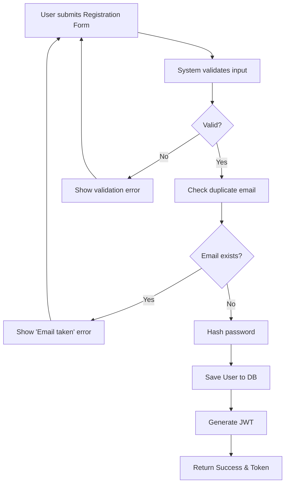
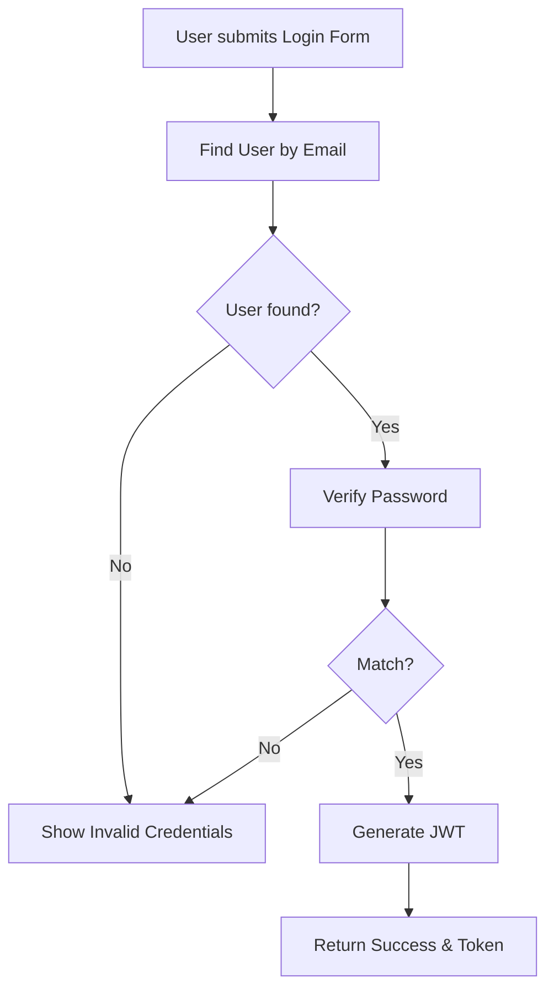

# User Authentication

## Business Overview
The Authentication module ensures secure access to the CollabTask platform. It handles user registration and login, issuing JWT tokens for session management. This module is critical for protecting user data and ensuring that only authorized personnel can access projects and tasks.

## Functional Requirements

**FR-001**: The system shall allow new users to register with their name, email, password, and role.
**FR-002**: The system shall not allow users to register with an email that already exists.
**FR-003**: The system shall encrypt user passwords before storing them.
**FR-004**: The system shall allow users to login with their registered email and password.
**FR-005**: The system shall validate email format and password strength (implicit via @Valid).
**FR-006**: The system shall issue a JWT token upon successful login or registration.

## User Roles & Permissions

### All Roles (Admin, Manager, Member)
- Register account
- Login to account

## User Workflows

### Workflow: User Registration

#### Steps:
1. User provides Name, Email, Password, Role.
2. System validates format.
3. System checks if email is unique.
4. System creates user record with hashed password.
5. System logs user in immediately (returns token).

### Workflow: User Login

## Business Rules & Validations

**BR-001**: Email must be unique across the system.
**BR-002**: Passwords must be encrypted using BCrypt.
**BR-003**: Users must be assigned a role upon registration.

## Data Entities

### User
- **Purpose**: Represents a registered user of the system.
- **Attributes**: UserId, Name, Email, Password (Hashed), Role, CreatedAt.
- **Relationships**: 
    - One-to-Many with Projects (Owner).
    - Many-to-Many with Projects (Member).
    - One-to-Many with Tasks (Assignee).

## Integration Points

- **Front-end Auth Feature**: Consumes `/api/auth/register` and `/api/auth/login`.
- **Spring Security**: Used for password encoding and context management.
- **JWT Util**: Generates tokens for API authorization.

## Business Scenarios

**US-001**: As a new user, I want to register so that I can access the platform.
- Acceptance Criteria:
  - [ ] Valid data creates account.
  - [ ] Duplicate email shows error.
  - [ ] Success returns a token.

**US-002**: As a registered user, I want to login so that I can manage my tasks.
- Acceptance Criteria:
  - [ ] Valid credentials return token.
  - [ ] Invalid credentials show error.

## Assumptions & Constraints

### Assumptions
- Users have a valid email address.
- JWT is sufficient for stateless session management.

### Constraints
- Passwords cannot be recovered (hashed), only reset (future scope, currently just login/register).
