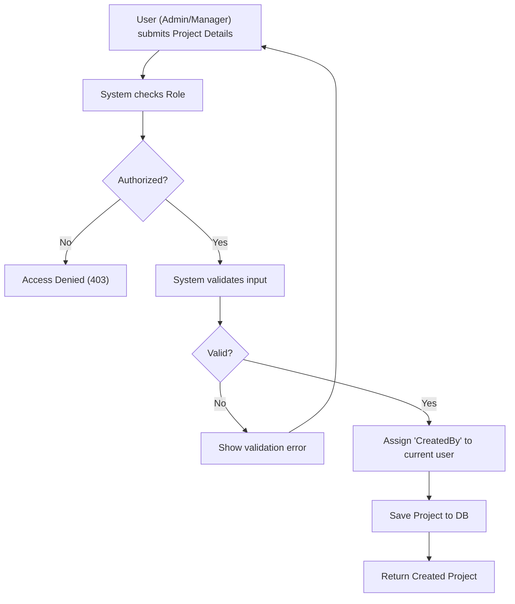
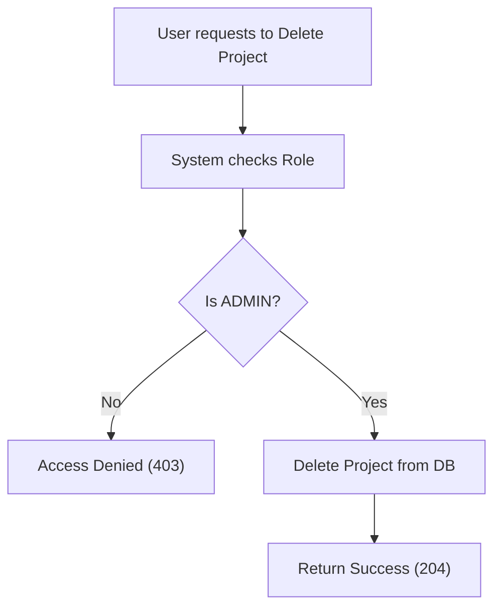

# Project Management

## Business Overview
The Project Management module allows teams to organize their work into discrete projects. It supports tracking priorities, teams, and status, ensuring that work is categorized and manageable. Different user roles have specific permissions to maintain data integrity and workflow control.

## Functional Requirements

**FR-007**: The system shall allow users to view a list of all projects.
**FR-008**: The system shall allow users to view detailed information for a specific project.
**FR-009**: The system shall allow users to filter projects by Team.
**FR-010**: The system shall allow users to filter projects by Priority (HIGH, MEDIUM, LOW).
**FR-011**: The system shall allow ADMIN and MANAGER users to create new projects.
**FR-012**: The system shall automatically set the "Created By" field to the currently logged-in user upon project creation.
**FR-013**: The system shall allow ADMIN and MANAGER users to update project details.
**FR-014**: The system shall allow ONLY ADMIN users to delete projects.

## User Roles & Permissions

### ADMIN
- View all projects
- Create new projects
- Update any project
- Delete any project

### MANAGER
- View all projects
- Create new projects
- Update any project

### MEMBER
- View all projects (Read-only access)

## User Workflows

### Workflow: Create Project

### Workflow: Delete Project

## Business Rules & Validations

**BR-004**: Only authenticated users can access project data.
**BR-005**: Projects must be associated with a valid Team (implied by `getProjectsByTeam` and `createProject` within team context usually).
**BR-006**: Priority must be one of: HIGH, MEDIUM, LOW.

## Data Entities

### Project
- **Purpose**: Represents a container for tasks and collaboration.
- **Attributes**: ProjectId, Name, Description, Status, Priority, CreatedBy (User), TeamId (implied relationship).
- **Relationships**:
    - Many-to-One with Team.
    - Many-to-One with User (Creator).
    - One-to-Many with Tasks.

## Integration Points

- **UserService**: Retrieves the current authenticated user to set `CreatedBy`.
- **TeamService**: Linked via Team ID for grouping projects.

## Business Scenarios

**US-003**: As a Manager, I want to create a new project so that my team can start working on new initiatives.
- Acceptance Criteria:
  - [ ] Can input name, description, priority.
  - [ ] Successfully creates project.

**US-004**: As a Member, I want to view projects by priority so I know what is urgent.
- Acceptance Criteria:
  - [ ] Filter by HIGH returns only high priority projects.

## Assumptions & Constraints

### Assumptions
- All users can view all projects (Open visibility model).

### Constraints
- Projects cannot be deleted by Managers, ensuring data safety.
