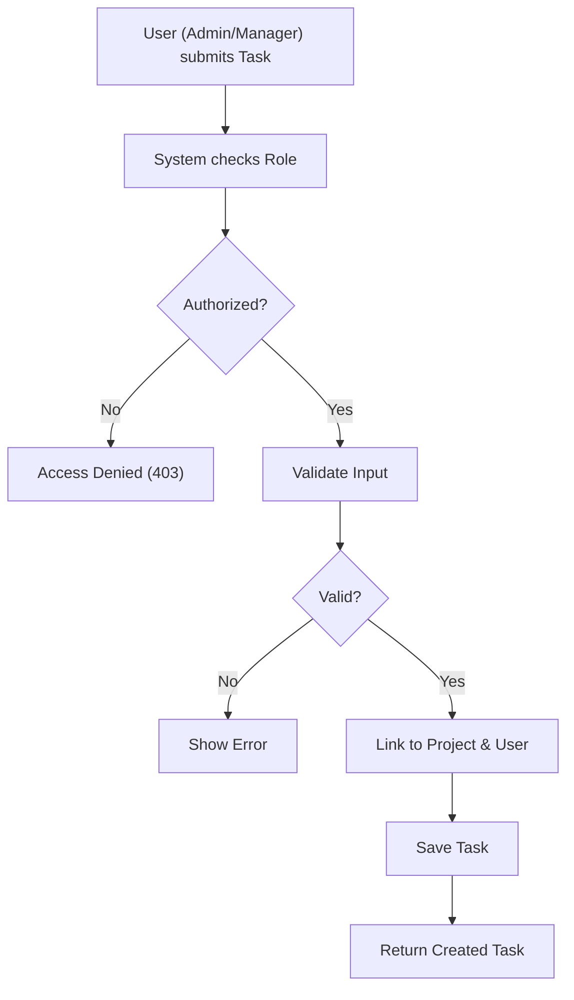
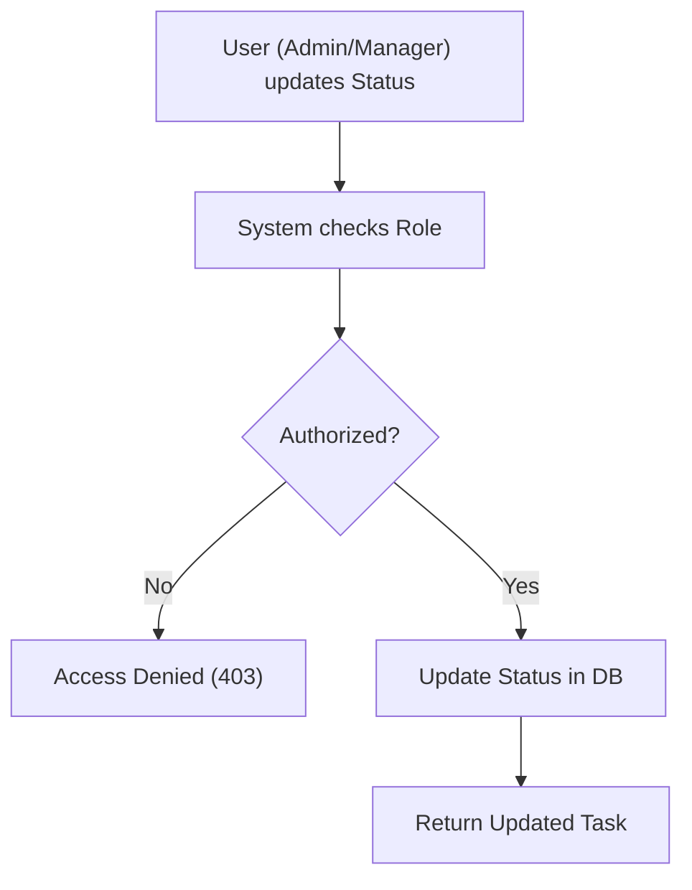

# Task Management

## Business Overview
The Task Management module is the core operational unit of CollabTask. It enables granular tracking of work within projects. Tasks can be assigned to users, prioritized, and tracked through various statuses (To Do, In Progress, Completed).

## Functional Requirements

**FR-015**: The system shall allow users to view all tasks.
**FR-016**: The system shall allow users to filter tasks by Project.
**FR-017**: The system shall allow users to filter tasks by Assigned User.
**FR-018**: The system shall allow users to filter tasks by Status and Priority.
**FR-019**: The system shall allow ADMIN and MANAGER users to create new tasks within a project.
**FR-020**: The system shall allow ADMIN and MANAGER users to update task details (Status, Priority, Assignee).
**FR-021**: The system shall allow ONLY ADMIN users to delete tasks.
**FR-022**: The system shall automatically set the Creator of the task.

## User Roles & Permissions

### ADMIN & MANAGER
- Create tasks
- Update tasks (change status, reassign, etc.)
- View all tasks

### ADMIN
- Delete tasks

### MEMBER
- View all tasks
- Filter tasks
- **Cannot** create, update, or delete tasks (ReadOnly).

## User Workflows

### Workflow: Create Task

### Workflow: Update Task Status

## Business Rules & Validations

**BR-007**: Tasks must belong to a valid Project.
**BR-008**: Tasks must have a valid Status (TO_DO, IN_PROGRESS, COMPLETED).
**BR-009**: Tasks must have a valid Priority (HIGH, MEDIUM, LOW).
**BR-010**: Members are restricted from updating task status; they must request updates from Managers/Admins (based on current implementation).

## Data Entities

### Task
- **Purpose**: Represents a unit of work.
- **Attributes**: TaskId, Title, Description, Status, Priority, DueDate, AssignedUserId, ProjectId, CreatedBy.
- **Relationships**:
    - Many-to-One with Project.
    - Many-to-One with User (Assignee).
    - Many-to-One with User (Creator).
    - One-to-Many with Comments.

## Integration Points

- **ProjectService**: Validates project existence.
- **UserService**: Validates assignee existence.

## Business Scenarios

**US-005**: As a Manager, I want to assign a task to a Member so that they know what to work on.
- Acceptance Criteria:
  - [ ] Select Member from list.
  - [ ] Task reflects new assignee.

**US-006**: As a Member, I want to see tasks assigned to me so I can prioritize my day.
- Acceptance Criteria:
  - [ ] Filter by "My Tasks" returns correct list.

## Assumptions & Constraints

### Assumptions
- Task dependencies (Task A blocks Task B) are not currently supported.

### Constraints
- Task history (audit log) is not currently implemented.
