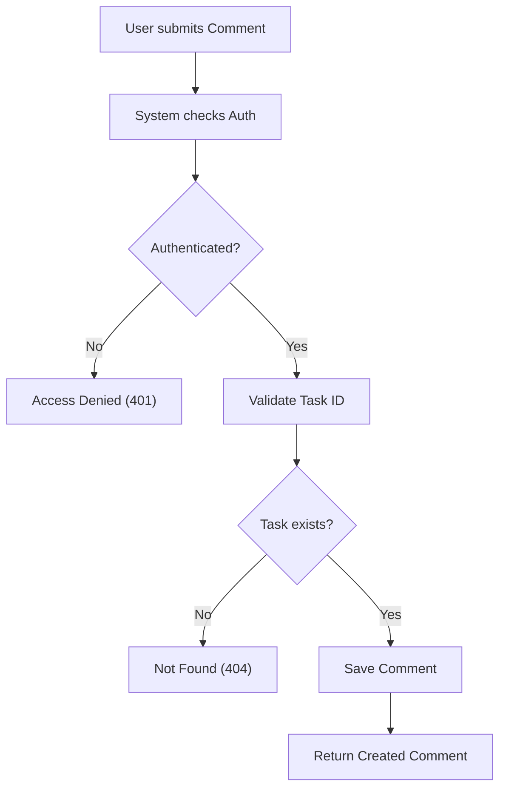
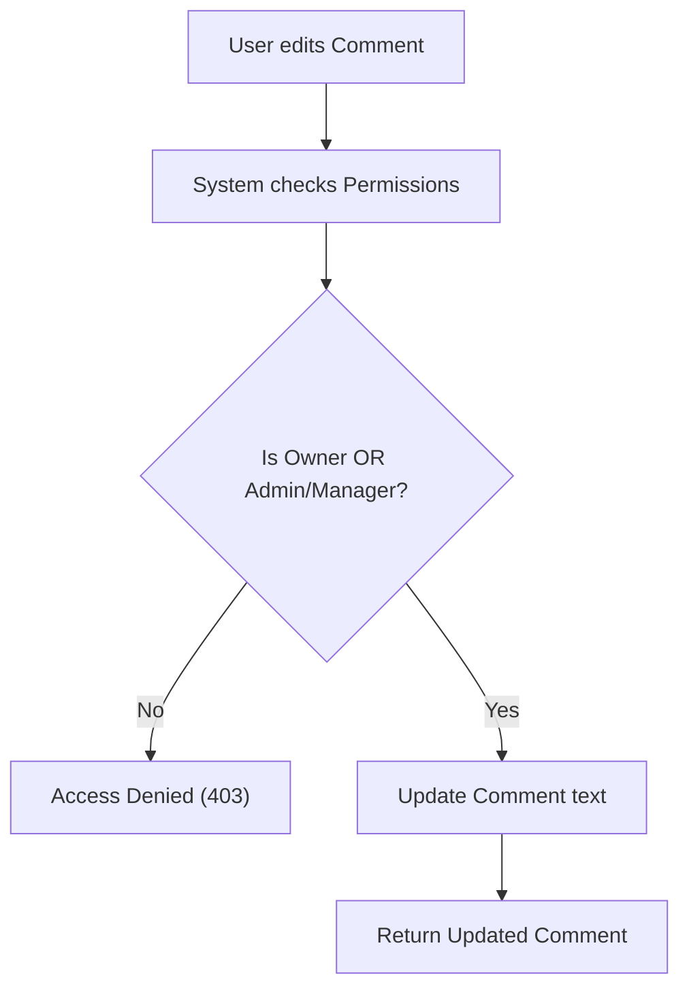

# Comment Management

## Business Overview
The Comment Management module facilitates collaboration/discussion on specific tasks. It allows team members to communicate context, updates, and questions directly on the task object, keeping information centralized.

## Functional Requirements

**FR-023**: The system shall allow all authenticated users (Admin, Manager, Member) to view comments on tasks.
**FR-024**: The system shall allow all authenticated users to create comments on any task.
**FR-025**: The system shall allow users to update their own comments.
**FR-026**: The system shall allow ADMIN and MANAGER users to update ANY comment.
**FR-027**: The system shall allow ONLY ADMIN users to delete comments.
**FR-028**: The system shall allow filtering comments by User or Task.

## User Roles & Permissions

### ADMIN
- Create comments
- Update ANY comment
- Delete ANY comment

### MANAGER
- Create comments
- Update ANY comment
- View all comments

### MEMBER
- Create comments
- Update OWN comments
- View all comments

## User Workflows

### Workflow: Post Comment

### Workflow: Edit Comment

## Business Rules & Validations

**BR-011**: Comments must be linked to a valid Task.
**BR-012**: Comment text cannot be empty.

## Data Entities

### Comment
- **Purpose**: Stores discussion text.
- **Attributes**: CommentId, Text, CreatedAt, TaskId, UserId (Author).
- **Relationships**:
    - Many-to-One with Task.
    - Many-to-One with User.

## Integration Points

- **TaskService**: Verifies task existence.

## Business Scenarios

**US-007**: As a Member, I want to comment on a task to ask for clarification.
- Acceptance Criteria:
  - [ ] Comment appears on task immediately.

**US-008**: As an Admin, I want to remove inappropriate comments.
- Acceptance Criteria:
  - [ ] Delete action removes comment permanently.
