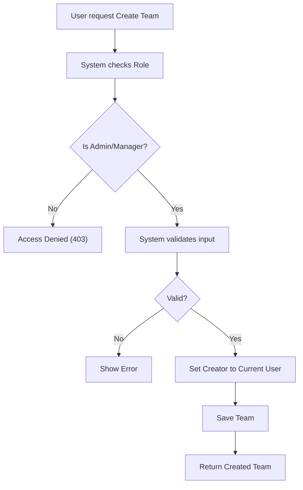

# Team Management

## Business Overview
The Team Management module organizes users into functional groups. Teams serve as the parent entity for projects, allowing for organized collaboration and resource allocation.

## Functional Requirements

**FR-029**: The system shall allow users to view all teams.
**FR-030**: The system shall allow ADMIN and MANAGER users to create new teams.
**FR-031**: The system shall allow ADMIN and MANAGER users to update team details.
**FR-032**: The system shall allow ONLY ADMIN users to delete teams.
**FR-033**: The system shall allow filtering teams by their Creator.
**FR-034**: The system shall allow retrieving specific team details by ID.

## User Roles & Permissions

### ADMIN
- View all teams
- Create teams
- Update teams
- Delete teams

### MANAGER
- View all teams
- Create teams
- Update teams

### MEMBER
- View all teams

## User Workflows

### Workflow: Create Team

## Business Rules & Validations

**BR-013**: Teams must have a unique name (suggested, though not explicitly enforced in controller code seen, good practice to note).
**BR-014**: All projects must belong to a team (validated in Project domain).

## Data Entities

### Team
- **Purpose**: Grouping mechanism for projects and users.
- **Attributes**: TeamId, Name, Description, CreatedAt, CreatedBy.
- **Relationships**:
    - Many-to-One with User (Creator).
    - One-to-Many with Projects.

## Integration Points

- **ProjectService**: Provides team context for project lists.
- **UserService**: Provides creator details.

## Business Scenarios

**US-009**: As an Admin, I want to create a generic "Engineering" team so that all tech projects can be housed there.
- Acceptance Criteria:
  - [ ] Team created successfully.
  - [ ] Available in project creation dropdowns.
