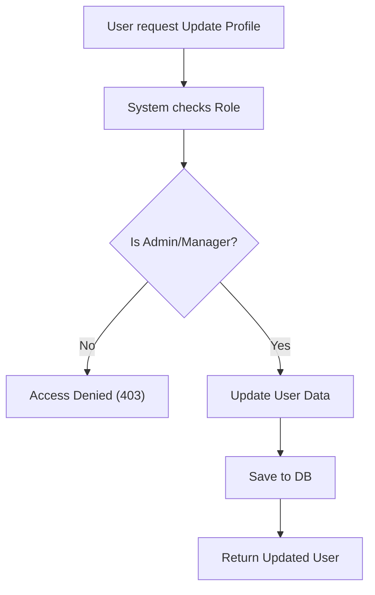
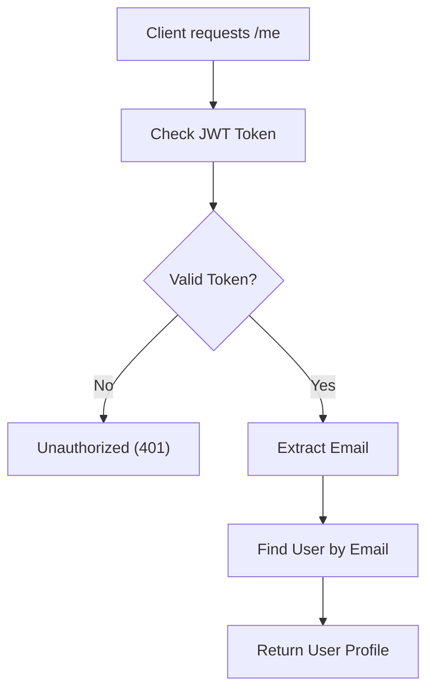

# User Management

## Business Overview
The User Management module handles the retrieval and administration of user profiles after authentication. It allows for role management, profile updates, and system-wide user administration.

## Functional Requirements

**FR-035**: The system shall allow ADMIN users to view all registered users.
**FR-036**: The system shall allow ADMIN users to filter users by Role.
**FR-037**: The system shall allow ANY authenticated user to view their own profile (/me).
**FR-038**: The system shall allow ANY authenticated user to view public profile details of other users by ID.
**FR-039**: The system shall allow ADMIN and MANAGER users to update user profiles (Name, Role, etc.).
**FR-040**: The system shall allow ONLY ADMIN users to delete user accounts.

## User Roles & Permissions

### ADMIN
- View all users
- Filter by role
- Update any user
- Delete any user

### MANAGER
- Update user profiles
- View user details
- View own profile

### MEMBER
- View own profile
- View other user details (read-only)

## User Workflows

### Workflow: Update User Profile

### Workflow: Get Current User

## Business Rules & Validations

**BR-015**: Users cannot change their own email address (as it is the unique identifier, assumed constraint).
**BR-016**: Only Admins can elevate a user's role to Admin/Manager (implicit in update logic restrictions).

## Data Entities

### User (Profile View)
- **Attributes**: UserId, Name, Email, Role, CreatedAt.

## Integration Points

- **AuthService**: Creates the initial user record.
- **Task/Project/Team/Comment Services**: User ID is the foreign key for all ownership and assignment.

## Business Scenarios

**US-010**: As an Admin, I want to promote a Member to Manager.
- Acceptance Criteria:
  - [ ] Update user role to MANAGER.
  - [ ] User now has Manager permissions.

**US-011**: As a User, I want to see my profile details to confirm my role.
- Acceptance Criteria:
  - [ ] /me returns correct name and role.
