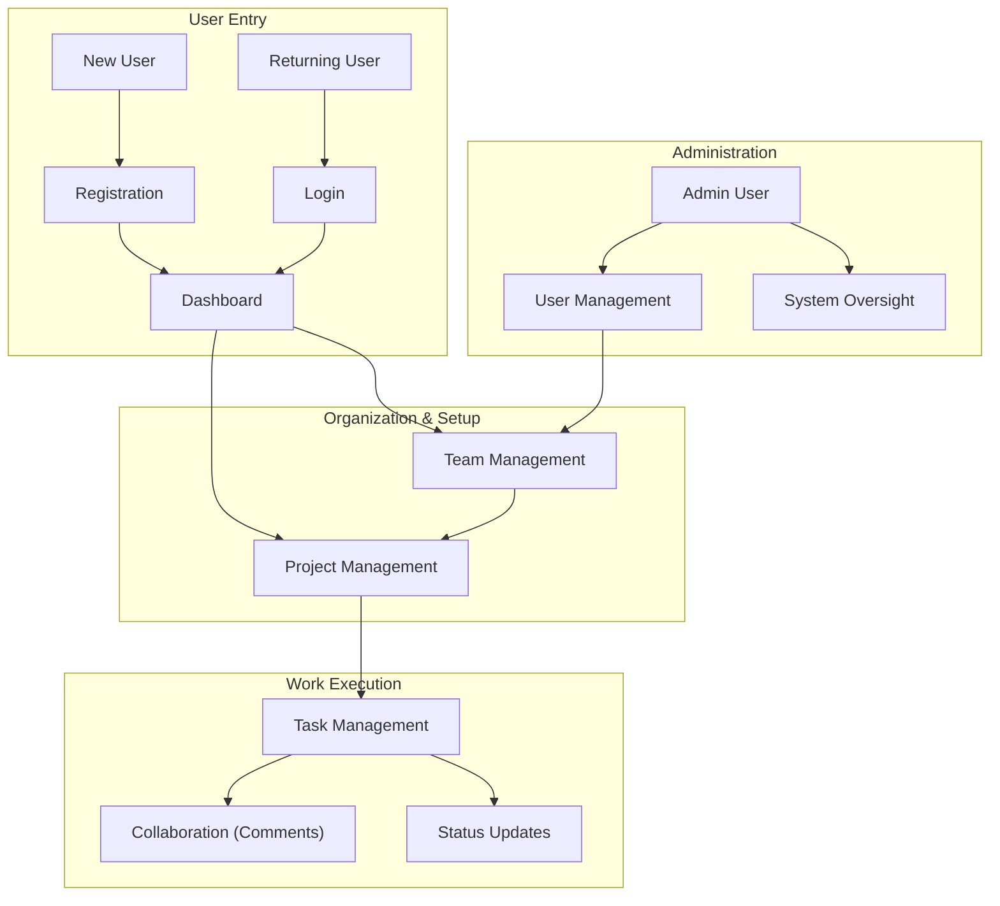

# Business Requirements Document
## CollabTask Project

**Version**: 1.0  
**Date**: 2025-12-16  
**Status**: Draft

---

## Business Process Overview

The CollabTask system is designed to streamline team collaboration through a hierarchical structure of Teams, Projects, and Tasks. Users enter the system via secure authentication. Once inside, they work within Teams to create Projects. Each Project acts as a container for Tasks, which are the fundamental units of work. Collaboration is verified through Comment threads on specific tasks, allowing for contextual communication.

---

## Executive Summary

### Project Overview
CollabTask is a project management and collaboration platform designed to help teams organize work, track progress, and communicate effectively. It provides a robust backend API serving a modern frontend interface, ensuring data integrity and user-friendly interaction.

### Business Objectives
- **Centralize Work**: Consolidate tasks and communication in one platform.
- **Improve Visibility**: Provide clear status and priority tracking for all projects.
- **Secure Access**: Ensure only authorized users access sensitive project data.
- **Streamline Operations**: Enable Managers and Admins to easily oversee team structures.

### Stakeholders
- **Admin**: System owner, manages all data and users.
- **Manager**: Team lead, manages projects and tasks.
- **Member**: Individual contributor, executes tasks and updates status.
- **Developers**: Maintain and extend the codebase.

### Scope
**In Scope**:
- User Authentication (JWT)
- Team & Project Management
- Task CRUD & Assignment
- Commenting System
- Role-based Access Control (RBAC)

**Out of Scope**:
- Real-time notifications (WebSockets) - Future Phase
- File Attachments - Future Phase
- Email Notifications - Future Phase
- Kanban Board Drag-and-Drop (API level done, UI specific)

### Success Criteria
- **User Adoption**: Teams successfully migrate workflows to the platform.
- **Performance**: API responses under 500ms.
- **Reliability**: Zero data loss during task updates.

---

## Table of Contents

1. Business Process Overview
2. Executive Summary
3. User Roles & Personas
4. Business Requirements by Domain
   - 4.1 User Authentication
   - 4.2 Project Management
   - 4.3 Task Management
   - 4.4 Comment Management
   - 4.5 Team Management
   - 4.6 User Management
5. Non-Functional Requirements
6. System Integrations
7. Assumptions & Constraints
8. Glossary

---

## User Roles & Personas

### ADMIN
**Description**: Super-user with full system access.
**Goals**: Maintain system health, manage user access, oversee all teams.
**Permissions**: Create/Read/Update/Delete (CRUD) on ALL resources.

### MANAGER
**Description**: Team leader responsible for project delivery.
**Goals**: Organize projects, assign tasks, unblock members.
**Permissions**: CRUD on Projects, Tasks, Teams; Can update User profiles.

### MEMBER
**Description**: Team member who executes work.
**Goals**: View assigned tasks, update status, ask questions via comments.
**Permissions**: Read access to Projects/Tasks/Teams; Create Comments; Update OWN comments.

---

## Business Requirements by Domain

### 4.1 User Authentication
**FR-001**: Register with unique email.
**FR-004**: Login to receive JWT.
*(See `01_user_authentication.md` for details)*

### 4.2 Project Management
**FR-007**: View all projects.
**FR-011**: Create projects (Admin/Manager).
**FR-009**: Filter projects by Team.
*(See `02_project_management.md` for details)*

### 4.3 Task Management
**FR-015**: View task lists.
**FR-019**: Create tasks (Admin/Manager).
**FR-020**: Update task status/assignee.
*(See `03_task_management.md` for details)*

### 4.4 Comment Management
**FR-024**: Post comments on tasks.
**FR-025**: Edit own comments.
*(See `04_comment_management.md` for details)*

### 4.5 Team Management
**FR-030**: Create teams (Admin/Manager).
**FR-033**: View teams by creator.
*(See `05_team_management.md` for details)*

### 4.6 User Management
**FR-035**: List all users (Admin).
**FR-037**: View own profile.
*(See `06_user_management.md` for details)*

---

## Non-Functional Requirements

### Performance
- **NFR-001**: API response time shall not exceed 500ms for read operations.
- **NFR-002**: Database queries for lists shall use pagination/filtering to maintain performance (implicit in implementation).

### Security
- **NFR-003**: Passwords must be hashed (BCrypt).
- **NFR-004**: All endpoints (except Auth) require valid Bearer JWT.
- **NFR-005**: Role-based checks must occur at the Controller/Service level.

### Scalability
- **NFR-006**: Backend shall be stateless (JWT) to support horizontal scaling.

---

## System Integrations

### Internal Modules
| Module | Integration Type | Data Exchanged |
|--------|-----------------|----------------|
| **Auth** | Security Context | User ID, Role, Email |
| **Task** | DB Relation | Project ID, User ID |
| **Comment** | DB Relation | Task ID, User ID |

### External Systems
| System | Purpose | Protocol |
|--------|---------|----------|
| **Database** | Persistence (MySQL/Postgres) | JDBC/JPA |
| **Frontend** | User Interface | REST API (JSON) |

---

## Assumptions & Constraints

### Business Assumptions
- Users are trustworthy within their assigned roles (e.g., Managers won't maliciously delete projects, though they have permission).
- Email is the primary method of user identification.

### Technical Constraints
- Backend is Java Spring Boot.
- Frontend is React.
- Authentication token expiration logic is handled by the client (refreshing not explicitly detailed in prompt but standard).

---

## Risks & Mitigation

| Risk | Impact | Probability | Mitigation |
|------|--------|-------------|------------|
| Data Loss | High | Low | Database backups (Operational concern). |
| Unauthorized Access | High | Low | Spring Security + JWT implementation strict enforcement. |
| Role Confusion | Medium | Medium | Clear UI indications of current permissions; Documentation. |

---

## Glossary

| Term | Definition |
|------|------------|
| **JWT** | JSON Web Token, used for stateless authentication. |
| **CRUD** | Create, Read, Update, Delete operations. |
| **RBAC** | Role-Based Access Control. |
| **DTO** | Data Transfer Object. |
