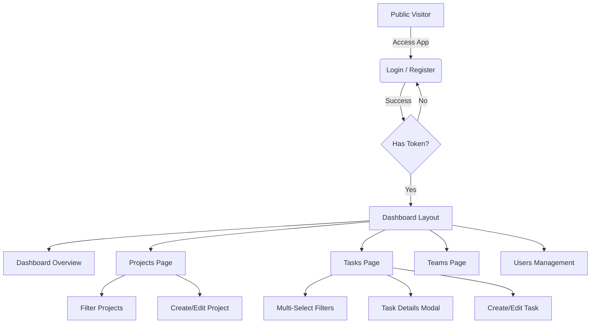
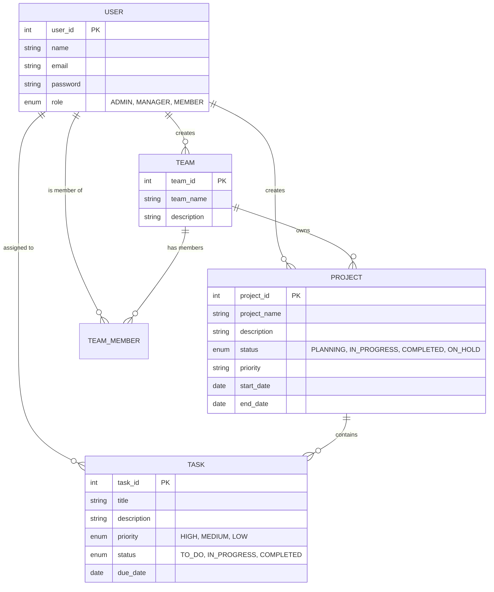

# CollabTask: Full Stack Project Management Platform


**CollabTask** is a comprehensive project management solution designed to streamline team collaboration. It features a robust **Spring Boot** backend for secure data handling and a modern **React** frontend for an intuitive user experience.

---

## 📋 Table of Contents
- [User Journey & Interface](#-user-journey--interface)
  - [Authentication](#1-authentication)
  - [Dashboard](#2-dashboard)
  - [Project Management](#3-project-management)
  - [Task Tracking](#4-task-tracking)
  - [Team & User Management](#5-team--user-management)
- [Backend Business Logic](#-backend-business-logic)
  - [Core Rules](#core-rules)
  - [API Documentation (Swagger)](#api-documentation-swagger)
  - [Data Model (ERD)](#data-model-erd)
- [Getting Started](#-getting-started)

---

## 🗺 User Journey & Interface

The application follows a secure and structured flow, as illustrated below. Users interact with a clean, responsive UI to manage their work.

### User Journey Flowchart



### 1. Authentication
Secure access is verified via JWT.
- **Register**: New users can create an account.
- **Login**: Existing users authenticate to receive a secure token.

| Register | Login |
| :---: | :---: |
|  |  |

### 2. Dashboard
The command center of the application. Provides a high-level overview of project statuses, pending tasks, and team activities.


### 3. Project Management
Users can create and manage multiple projects.
- **Projects Page**: View all projects with status indicators.
- **Filtering**: Filter projects by status or team.


### 4. Task Tracking
The core of productivity.
- **My Tasks**: A detailed view of all tasks assigned to the user or their team.
- **Advanced Filtering**: Use the **Professional Filter Bar** to slice data by Status, Priority, Project, or Assignee.
- **Task Search**: Instant text search for task titles.


### 5. Team & User Management
- **Teams**: Manage team creation and member lists.
- **Users**: Admin-accessible user management (Edit/Delete users).

| Teams Page | Users Page |
| :---: | :---: |
|  |  |

---

## 🧠 Backend Business Logic

The backend enforces strict data integrity and business rules.

### Core Rules

#### Projects
- **Deletion Protection**: A project *cannot* be deleted if it has associated tasks. This prevents data loss.
- **Status Workflow**: `PLANNING` → `IN_PROGRESS` → `COMPLETED` (or `ON_HOLD`).

#### Tasks
- **Overdue Logic**: Tasks are automatically flagged as overdue if `Due Date < Today` and status is not `COMPLETED`.
- **Assignment**: Tasks can be re-assigned or left unassigned.

#### Access Control (RBAC)
- **ADMIN**: Full system access (User management, etc.).
- **MANAGER**: Team and Project management.
- **MEMBER**: Standard access (Create tasks, update status).

### API Documentation (Swagger)

The API is fully documented using Swagger UI.

#### Auth & Comments
Endpoints for user authentication and task comments.


#### Teams & Users
Endpoints for managing team structures and user accounts.


#### Projects & Tasks
Core endpoints for the main application entities.


#### Data Schemas
Comprehensive request/response bodies.


### Data Model (ERD)

The following diagram illustrates the relationship between Users, Teams, Projects, and Tasks.



---

## 🚀 Getting Started

To run the full stack application locally:

### 1. Backend (Spring Boot)
```bash
cd backend/collabtask-api
mvn spring-boot:run
```
*Server runs on port 8080.*

### 2. Frontend (React)
```bash
cd frontend
npm install
npm run dev
```
*App runs on http://localhost:5173.*

---
*CollabTask Documentation*
