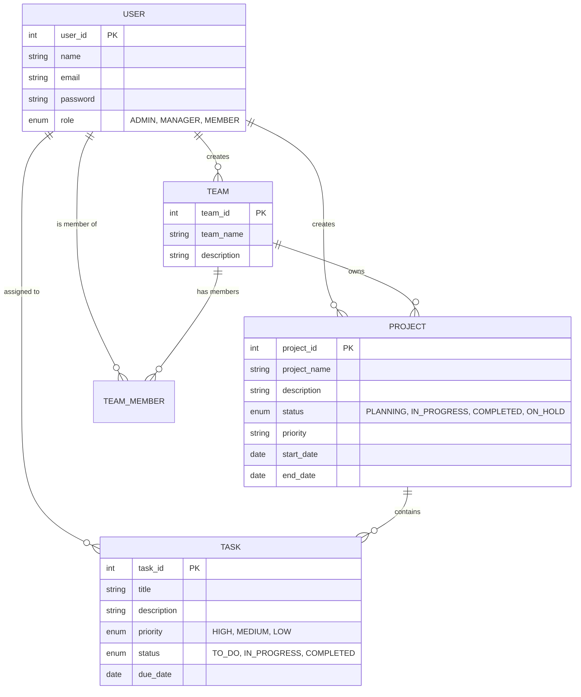

# CollabTask Backend API


Welcome to the **CollabTask Backend API**, the robust server-side foundation for the CollabTask project management platform. This application provides RESTful endpoints to manage projects, tasks, teams, and users, enforcing business consistency and data integrity.

## 📋 Table of Contents
- [Overview](#overview)
- [Business Logic & Rules](#business-logic--rules)
  - [Projects](#projects)
  - [Tasks](#tasks)
  - [Users & Teams](#users--teams)
- [Data Model](#data-model)
- [Getting Started](#getting-started)

## 📖 Overview

The CollabTask API is built with **Spring Boot** and utilizes **Hibernate/JPA** for data persistence. It is designed to handle complex relationships between teams, projects, and tasks while providing search capabilities and status tracking.

## 🧠 Business Logic & Rules

### Projects
Projects are the high-level containers for work items.
- **Creation**: Projects must be associated with a valid **Team** and a **Creator (User)**.
- **Constraints**:
  - **Deletion Protection**: A project *cannot* be deleted if it contains any tasks. This prevents orphan tasks and data loss.
- **Status Workflow**: `PLANNING` → `IN_PROGRESS` → `COMPLETED` (or `ON_HOLD`).
- **Priorities**: Projects can be flagged with priorities like `HIGH`, `MEDIUM`, or `LOW`.

### Tasks
Tasks represent individual units of work within a project.
- **Assignment**: Tasks can be assigned to a specific **User** or left unassigned.
- **Overdue Logic**: A task is considered **Overdue** if:
  - `Due Date` < Current Date
  - `Status` is **NOT** `COMPLETED`
- **Search**: Tasks can be searched by title.
- **Status Workflow**: `TO_DO` → `IN_PROGRESS` → `COMPLETED`.

### Users & Teams
- **Roles**: Users are assigned roles that define their permissions:
  - `ADMIN`: Full system access.
  - `MANAGER`: Can manage team-level resources.
  - `MEMBER`: Standard participant.
- **Teams**: Teams group users and projects together.

## 📊 Data Model

The following Entity Relationship Diagram (ERD) illustrates the core data structure and relationships defined in the backend:



## 🚀 Getting Started

### Prerequisites
- Java 17 or higher
- Maven 3.6+

### Usage

1. **Clone the repository** (if not already done).
2. **Navigate to the backend directory**:
   ```bash
   cd backend/collabtask-api
   ```
3. **Run the application**:
   ```bash
   mvn spring-boot:run
   ```
   The server will start on port `8080` (default).

---
*Generated for CollabTask Development Team*
