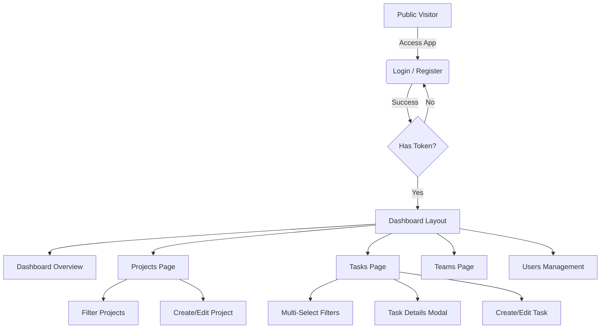

# CollabTask Frontend


The **CollabTask Frontend** is a modern, responsive single-page application (SPA) built to provide a seamless project management experience. It features a robust design system, interactive data filtering, and role-based access control.

## 📋 Table of Contents
- [Tech Stack](#-tech-stack)
- [User Journey & Navigation](#-user-journey--navigation)
- [Business Logic & Features](#-business-logic--features)
  - [Authentication & Security](#authentication--security)
  - [Task Management](#task-management)
  - [Access Control](#access-control)
- [Project Structure](#-project-structure)
- [Getting Started](#-getting-started)

## 🛠 Tech Stack

- **Framework**: React 18 with Vite for lightning-fast builds.
- **Styling**: Tailwind CSS for utility-first responsive design.
- **State Management**: React Query (TanStack Query) for server state; Context API for Auth.
- **Forms**: React Hook Form for performant validation.
- **Routing**: React Router DOM v6.

## 🗺 User Journey & Navigation

The application follows a secure flow where users must authenticate before accessing the dashboard and management features.



## 🧠 Business Logic & Features

### Authentication & Security
- **JWT Storage**: Authentication tokens are securely stored and attached to API requests via Axios interceptors.
- **Protected Routes**: Navigation to app pages is guarded; unauthenticated users are redirected to `/login`.
- **Auto-Logout**: Invalid tokens trigger an automatic logout and redirect.

### Task Management
- **Advanced Filtering**: The Tasks page features a "Professional Filter Bar" supporting:
  - **Multi-Select**: Filter by multiple Statuses, Priorities, Projects, or Assignees simultaneously.
  - **Text Search**: Real-time filtering by task title.
  - **Date Filter**: Filter by specific due dates.
- **CRUD Operations**: Full Create, Read, Update, Delete capabilities with modal-based forms.

### Access Control
The UI adapts based on the user's role (`ADMIN`, `MANAGER`, `MEMBER`).
- **Visibility Rules**:
  - `MEMBER` users perform a read-only role in certain contexts. For example, the **"New Task"** button is hidden for Members on the Tasks page.
  - `ADMIN` users have full access to User Management APIs and UI.

## 📂 Project Structure

```text
src/
├── components/     # Reusable UI components (Buttons, Inputs, Modals, etc.)
├── features/       # Feature-based modules (Auth, Projects, Tasks slices)
├── layouts/        # Layout wrappers (AppLayout, AuthLayout)
├── pages/          # Full page components (Dashboard, TasksPage, etc.)
├── routes/         # Routing configuration and Guards
├── services/       # API call definitions (Axios instances)
├── types/          # TypeScript definitions
└── App.tsx         # Root component
```

## 🚀 Getting Started

### Prerequisites
- Node.js 16+
- npm or yarn

### Installation

1. **Navigate to the frontend directory**:
   ```bash
   cd frontend
   ```
2. **Install dependencies**:
   ```bash
   npm install
   ```
3. **Start the development server**:
   ```bash
   npm run dev
   ```
   The app will run at `http://localhost:5173` (default).

---
*Built with ❤️ by the CollabTask Team*
